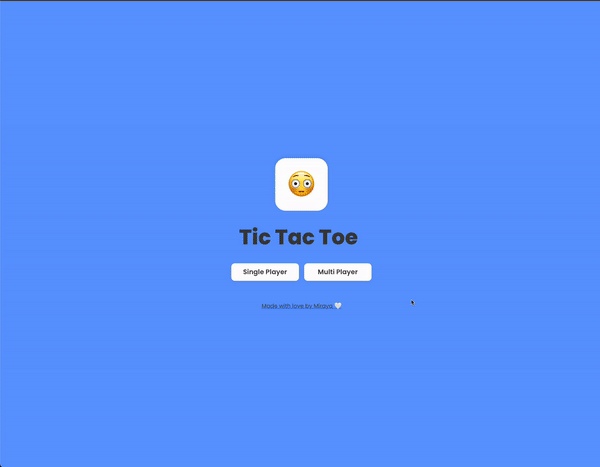

# 😛 XO Rumble — Tic-Tac-Emoji

An emoji-powered Tic-Tac-Toe game built with **React** and **TypeScript**. XO Rumble brings classic gameplay to life with animated UI, randomly generated emojis, and both single-player and local multiplayer modes.

---

## 📸 Demo



---

## ⚙️ Features

* 😄 **Emoji-Based Gameplay**

  * New random emojis every game
  * Fresh visual experience each round
* 🧠 **Single Player Mode**

  * Play against a bot
  * Easy and Hard difficulty options
* 👥 **Local Multiplayer Mode**

  * Two players on the same device
  * Automatic emoji assignment per round
* 💾 **Persistent Game State**

  * Resume games after refresh or page leave
* 🎬 **Smooth Animations**

  * Animated transitions and interactions
* 📱 **Responsive Design**

  * Optimized for desktop and tablet screens

---

## 🎞️ Animations & Interactions

* Emoji hover and selection animations
* Modal transitions for game results
* Turn-based visual feedback
* Motion effects powered by Framer Motion

---

## 🚀 Getting Started

1. Clone or download the repository
2. Install dependencies
3. Run the development server
4. Open the local URL provided by Vite

The game runs entirely in the browser.

---

## 📂 Project Structure

```
tic-tac-emoji/
├── public/            # Static assets
├── src/
│   ├── assets/        # Icons and shared variables
│   ├── components/    # Game components
│   │   ├── SinglePlayer
│   │   ├── MultiPlayer
│   │   ├── Spinner
│   │   └── Start
│   ├── util/          # Helpers and utilities
│   ├── App.tsx
│   ├── GlobalStyles.tsx
│   └── main.tsx
├── index.html
├── README.md
└── vite.config.ts
```

---

## ⚡ Technologies Used

* Vite
* React
* TypeScript
* Zustand
* Styled Components
* Framer Motion

---

## 🔧 Known Limitations

* The game does not function correctly on Android devices

---

## 🔮 Future Improvements

* Sound effects and background music
* Highlight winning three-in-a-row tiles
* Improved mobile support
* Additional emoji themes

---

**Built with 😛, React ⚛️, and TypeScript 💙**
